<div align="center">



# SOLDEUS

### Security Engineering · Offensive Security · Cloud · Linux · OT/ICS

**I build systems. I break systems. I detect what happened. I harden the failure.**

[](#mission)
[](#the-loop)
[](#cloud-engineering)
[](#linux--systems)
[](#offensive-security)
[](#otics-security)

</div>

---

## `~/identity`

> **SOLDEUS is a technical portfolio, not a résumé wall.**
>
> Every serious claim should point to evidence: a lab, a repository, a write-up, a configuration, a detection, a packet capture, a Terraform plan, or a reproducible result.

**Primary direction:** `Security Engineering × Cloud Engineering × Offensive Security`

**Deepening direction:** `Linux / Systems × OT/ICS`

**Method:** `BUILD → ATTACK → DETECT → HARDEN → REPEAT`

**Environment:** controlled local / virtualized / cloud labs and explicitly authorized targets only.

---

## `~/the-loop`

```text
                 ┌──────────────┐
                 │    BUILD     │
                 │ architecture │
                 │    + code    │
                 └──────┬───────┘
                        │
                        ▼
                 ┌──────────────┐
                 │    ATTACK    │
                 │   emulate    │
                 │  the threat  │
                 └──────┬───────┘
                        │
                        ▼
                 ┌──────────────┐
                 │    DETECT    │
                 │ logs · hunt  │
                 │   telemetry  │
                 └──────┬───────┘
                        │
                        ▼
                 ┌──────────────┐
                 │    HARDEN    │
                 │ reduce the   │
                 │  attack path │
                 └──────┬───────┘
                        │
                        └──────────────► REPEAT
```

**No lab is finished when the exploit works.** It is finished when the failure is understood, observable, mitigated, and re-tested.

---

## `~/mission`

I am building toward a security-engineering profile that can move across **networks, Linux systems, cloud infrastructure, offensive testing, defensive telemetry, and industrial control environments**.

### The four-year paid-certification spine

```text
YEAR 1                 YEAR 2                 YEAR 3                 YEAR 4
──────                 ──────                 ──────                 ──────
CCNA                   RHCSA                  AWS SAA                PEN-200 / OSCP+
NETWORK                LINUX                  CLOUD                  OFFENSIVE SECURITY
```

Supporting study runs continuously around that spine:

```text
Fortinet NSE 1 / 2 / 3
        │
        ├── Security fundamentals
        ├── Network-security exposure
        └── Fortinet ecosystem familiarity

Python · Bash · C · C++ · SQL · Terraform · Git · Docker

Modbus · DNP3 · OPC UA · SCADA · PLC · HMI · IEC 62443 · NIST SP 800-82
```

> **Certification = proof of study. Project = proof of ability.**
>
> A certification moves to `EARNED` only after the credential is actually obtained.

---

## `~/focus`

### Security Engineering

- Threat modeling and attack-surface mapping
- Trust boundaries, identity, access control, and least privilege
- Vulnerability analysis and exploitability
- Secure configuration and hardening
- Detection, logging, investigation, and remediation
- Security design with measurable validation

### Linux / Systems

- SSH, users, groups, permissions
- Processes, services, `systemd`, logs
- Storage and LVM
- Host networking and packet-level troubleshooting
- `firewalld` and SELinux
- C / C++ for low-level reasoning and binary-oriented work

### Cloud Engineering

- AWS VPC architecture
- Public / private / isolated network design
- EC2, RDS, load balancing, IAM
- CloudTrail and CloudWatch
- Security groups and NACLs
- AWS CLI, Terraform, CI/CD security controls

### Offensive Security

- Reconnaissance and enumeration
- Web application attack surfaces
- Active Directory attack paths
- Linux / Windows privilege escalation
- Authentication and access-control abuse
- Reporting, remediation, and re-test
- **Authorized labs and CTF environments only**

### Blue Team / Detection

- Security telemetry and log pipelines
- SIEM concepts and investigation
- Threat hunting methodology
- Detection engineering and tuning
- Incident-response lifecycle
- Evidence-driven remediation

### OT / ICS Security

- Modbus
- DNP3
- OPC UA
- SCADA / PLC / HMI architecture
- IT/OT segmentation and industrial DMZ concepts
- IEC 62443 concepts
- NIST SP 800-82 concepts

---

## `~/languages-and-infrastructure`

| Priority | Technology | Purpose |
|---|---|---|
| **P1** | **Python** | Automation, security tooling, APIs, protocol analysis |
| **P2** | **Bash** | Linux administration and repeatable security workflows |
| **P3** | **C** | Memory, processes, pointers, binaries, systems reasoning |
| **P4** | **C++** | Firmware, embedded systems, low-level engineering |
| **P5** | **SQL** | Data access, application security, investigation |
| **P6** | **Terraform / HCL** | Infrastructure as Code and cloud security |
| **P7** | **KQL** | Detection and investigation in Microsoft security environments |
| Later | **Rust / Go** | Systems and infrastructure specialization |

---

## `~/projects`

### 01 · ARGUS — Defensive ICS Intelligence Platform

**Flagship build.** A Python-first defensive platform for industrial-network visibility, OT asset mapping, protocol-aware analysis, exposure reporting, and security telemetry.

`Python` `Modbus/TCP` `OT/ICS` `Grafana` `APIs` `network visibility`

→ [`projects/argus-ics/README.md`](projects/argus-ics/README.md)

### 02 · Cloud Security Lab

An isolated AWS environment deliberately designed to be **built, attacked, observed, hardened, and re-tested**.

`AWS` `IAM` `VPC` `CloudTrail` `CloudWatch` `Terraform` `CI/CD`

→ [`projects/cloud-security-lab/README.md`](projects/cloud-security-lab/README.md)

### 03 · Adversarial Lab

A local / virtualized attack-and-defense range for Windows, Linux, Active Directory, web applications, privilege escalation, detection, and remediation experiments.

`Windows` `Linux` `AD` `web security` `Wireshark` `logs`

→ [`projects/adversarial-lab/README.md`](projects/adversarial-lab/README.md)

### 04 · Network Security Lab

A reproducible network environment for packet analysis, segmentation, ACL validation, reconnaissance, and Python-based network tooling.

`CCNA` `TCP/IP` `Wireshark` `Python` `Linux`

→ [`projects/network-security-lab/README.md`](projects/network-security-lab/README.md)

### 05 · Linux Hardening Lab

A hands-on Linux administration and security environment aligned with RHCSA-level operational work.

`RHEL` `SSH` `SELinux` `firewalld` `systemd` `LVM`

→ [`projects/linux-hardening-lab/README.md`](projects/linux-hardening-lab/README.md)

---

## `~/certification-ledger`

| Certification | Role in the stack | Status |
|---|---|---|
| Fortinet NSE 1 | Security fundamentals | `PLANNED` |
| Fortinet NSE 2 | Security / threat fundamentals | `PLANNED` |
| Fortinet NSE 3 | Fortinet networking / operator exposure | `PLANNED` |
| Cisco CCNA | Networking foundation | `PLANNED` |
| Red Hat RHCSA / EX200 | Linux administration | `PLANNED` |
| AWS Solutions Architect – Associate | Cloud architecture | `PLANNED` |
| OffSec PEN-200 / OSCP+ | Practical offensive security | `PLANNED` |
| Fortinet OT Security | OT/ICS specialization | `LATER` |

**Never present `PLANNED` or `IN PROGRESS` items as earned credentials.**

---

## `~/lab-stack`


---

## `~/engineering-principles`

```text
01. Understand the system before touching it.
02. Build the lab before claiming the skill.
03. Automate the repeat; understand the automation.
04. Least privilege. Explicit trust boundaries.
05. Hypothesis → test → evidence → fix → re-test.
06. Ship reproducible work.
07. Log the important event; preserve the evidence.
08. Break it in the lab so it survives in production.
09. Test only systems I own or am explicitly authorized to test.
10. Evidence beats adjectives.
11. BUILD → ATTACK → DETECT → HARDEN → REPEAT.
```

---

## `~/portfolio-standard`

Every serious project should contain, where applicable:

```text
README.md
├── Objective
├── Threat model / attack surface
├── Architecture
├── Lab topology
├── Build / deployment steps
├── Attack simulation
├── Evidence
├── Detection
├── Mitigation
├── Re-test
├── Lessons learned
└── Limitations / next steps
```

Evidence can include sanitized screenshots, packet captures, terminal output, configuration diffs, Terraform plans, detection queries, timelines, and post-test notes.

---

## `~/contact`

**GitHub:** [github.com/0xsoldeus](https://github.com/0xsoldeus)

Open an issue around a concrete lab artifact, result, detection, or engineering question.

<div align="center">

`soldeus@lab:~$ build. attack. detect. harden. repeat.`

</div>
