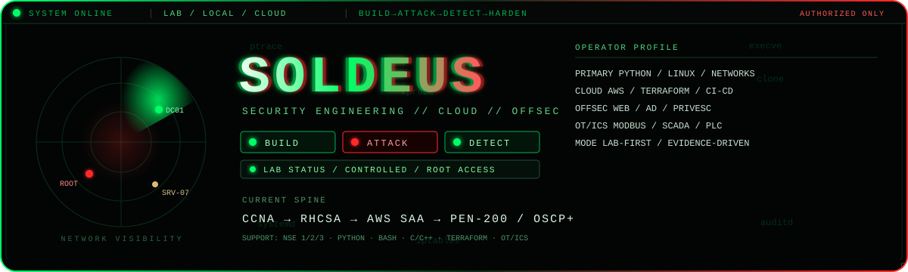

<div align="center">



# SOLDEUS

### Security Engineering · Offensive Security · Cloud · Linux · OT/ICS

**I build systems. I break systems. I detect what happened. I harden the failure.**

[](#mission)
[](#the-loop)
[](#cloud-engineering)
[](#linux--systems)
[](#offensive-security)
[](#otics-security)

</div>

---

## `~/identity`

**Primary direction:** `Security Engineering × Cloud Engineering × Offensive Security`

**Deepening direction:** `Linux / Systems × OT/ICS`

**Method:** `BUILD → ATTACK → DETECT → HARDEN → REPEAT`

**Environment:** controlled local / virtualized / cloud labs and explicitly authorized targets only.

---

## `~/mission`

I am building toward a security-engineering profile that can move across **networks, Linux systems, cloud infrastructure, offensive testing, defensive telemetry, and industrial control environments**

## `~/lab-stack`


---

## `~/engineering-principles`

```text
01. Understand the system before touching it.
02. Build the lab before claiming the skill.
03. Automate the repeat; understand the automation.
04. Least privilege. Explicit trust boundaries.
05. Hypothesis → test → evidence → fix → re-test.
06. Ship reproducible work.
07. Log the important event; preserve the evidence.
08. Break it in the lab so it survives in production.
09. Test only systems I own or am explicitly authorized to test.
10. Evidence beats adjectives.
11. BUILD → ATTACK → DETECT → HARDEN → REPEAT.
```

## `~/contact`

**GitHub:** [github.com/0xsoldeus](https://github.com/0xsoldeus)

Open an issue around a concrete lab artifact, result, detection, or engineering question.

<div align="center">

`soldeus@lab:~$ build. attack. detect. harden. repeat.`

</div>
